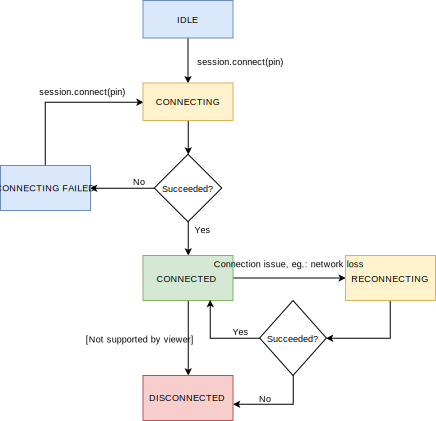

# Rescue Live Android SDK

- [Introduction](#introduction)
- [Requirements](#requirements)
- [Add the SDK dependency](#add-the-sdk-dependency)
- [Support Flow](#support-flow)
- [Usage](#usage)
- [Session states](#session-states)
- [SDK implications on your app](#sdk-implications-on-your-app)
- [Data Masking](#data-masking)
- [Bug report](#bug-report)
- [Migration Guide](#migration-guide)

## Introduction
The Rescue Live Mobile SDK allows your customers to establish a Rescue Live support session within your app.

Take advantage of In-App Support:

- Gain access to end-user app issues and enable quicker problem resolution without the end-user ever leaving the app
- Optimize the customer experience with a seamless, intuitive customer support solution
- Reduce app abandonment levels
- Maximize customer satisfaction

The support representatives will be able to create remote app sharing sessions from the same Agent console where the web-based co-browse sessions are managed.

## Requirements

To use the SDK you will need an API key from your LogMeIn Rescue Live Guide point of contact.

Your development environment must meet the following requirements:

* Android Studio 3.0+
* Minimum Android SDK level: API 16 or higher
* Supported architectures: armeabi-v7a, arm64-v8a, x86, x86_64
* Set sourceCompatibility and targetCompatibility for supporting [Java 8](#java-8) features

### Java 8

The SDK is extensively use Java 8 language features that implies the followings:

- JDK 8+ is required for compiling the embedder app
- You should configure your project for supporting Java 8 features. Add the following lines to the corresponding gradle file: [official documentation](https://developer.android.com/studio/write/java8-support.html)

``` java
android {
  compileOptions {
    sourceCompatibility JavaVersion.VERSION_1_8
    targetCompatibility JavaVersion.VERSION_1_8
  }
  // For Kotlin projects
  kotlinOptions {
    jvmTarget = "1.8"
  }
}
```

### Memory considerations
The implementation of the screen sharing feature allocates considerable amount of memory, which may cause an `OutOfMemoryError` in the embedder application. Therefore, the embedder application should add the `largeHeap=true` attribute to its application tag, in the AndroidManifest.xml.

**AndroidManifest.xml**

``` xml

<application android:name=".MyApplication"
    android:icon="@drawable/ic_launcher"
    android:label="@string/app_name"
    android:largeHeap="true"
    android:logo="@drawable/logo"
    android:theme="@style/AppTheme" >
</application>

```

## Add the SDK dependency

Define the maven repositories required by the SDK as well as the dependencies by adding the following lines to the build.gradle file of your application module:

``` java
repositories {
   jcenter()
   maven { url 'https://raw.githubusercontent.com/logmeinrescue/Rescue-Live-Android-SDK/master/maven/repository' }
}
...
dependencies {
   implementation('com.logmein.rescuelive:sdk:1.0.0-beta.3')
}
```

## Support Flow

The Rescue Live Mobile SDK leverages the same PIN-based connection as the web co-browse solution. The main difference is that in the case of Mobile SDK the session PIN is currently generated by the support representative in the Agent Console and the PIN code is to be entered in the supported mobile app.

High-level flow today:

1. Support representative and customer are engaged via phone/chat
2. Support representative to create a Mobile App support session in the Agent Console (generates a 9-digit PIN)
3. Customer to enter PIN to the input field within the app (the PIN entry fields needs to be implemented by app owner when adding the SDK to the app)
4. Customer to hit connect button (also to be implemented by app owner)
5. Screen sharing started

<div style="page-break-after: always;"></div>

## Usage

Java example

``` java
import com.logmein.rescue.livesdk.api.SupportSession;

public class YourClass implements SupportSession.StateListener {
    private final SupportSession supportSession;

    public YourClass(Context applicationContext) {
        SupportSession.Factory supportSessionFactory = SupportSession.Factory.newInstance("your_api_key");
        supportSession = supportSessionFactory.create(applicationContext);
        supportSession.setStateListener(this);
    }

    public void connect(String pin) {
        // The pin should be used without whitespaces as a String with length of 9, eg.: 123456789
        supportSession.connect(pin);
    }

    public void disconnect() {
        supportSession.disconnect();
    }

    @Override
    public void onSessionStateChanged(@NotNull SupportSession.State newState) {
        // handle support session state changes
    }
}

```

Kotlin example

``` kotlin
import com.logmein.rescue.livesdk.api.SupportSession

class YourClass(applicationContext: Context) : SupportSession.StateListener { 
    private val supportSession: SupportSession

    init {
        val supportSessionFactory = SupportSession.Factory.newInstance("your_api_key")
        supportSession = supportSessionFactory.create(applicationContext)
        supportSession.setStateListener(this)
    }
    
    fun connect(pin: String) {
        supportSession.connect(pin)
    }

    fun disconnect() {
        supportSession.disconnect()
    }

    override fun onSessionStateChanged(newState: SupportSession.State) { 
        // handle support session state changes
    }
}
```

1. You instantiate a `SupportSession` object with your API key and your application's context using the `SupportSession.Factory` class. Be awere that the `SupportSession` object is not re-usable as described in [Session states](#session-states).
2. Call `supportSession.connect(pin)` with the 9-digit pin that was generated in the Agent console. The pin should be used without whitespaces as a String with length of 9, eg.: 123456789
3. After a successfull connection, your `SupportSession.StateListener` will be notified with a `SupportSession.State.CONNECTED` and your mobile application's screen will automatically appear in the Agent console and you will be able to remotely control your app
4. Your support session may end in one of the following cases (in each case your `SupportSession.StateListener` will be notified with a `SupportSession.State.DISCONNECTED` state):
    - The session is ended in the Agent console
    - You call `supportSession.disconnect()` in your application
    - The reconnection was unsuccessful


## Session states

The `SupportSession` goes through different states during its lifecycle and you will be notified with the current state on your `SessionListener`.



**The `SupportSession` object is not re-usable.** Do not call `supportSession.connect(...)` on a `SupportSession` object that has already reached the connected state, rather create a new `SupportSession` object for the subsequent session.

## SDK implications on your app

### Size

Using the SDK has implications on the size of your application, depending on the configuration of your build. Two major configurations reduce both the download and installation footprint of our SDK.

1. Use [Android App Bundle](https://developer.android.com/guide/app-bundle/) or configure multiple APKs for ABIs.
2. Use [code shrinking](https://developer.android.com/studio/build/shrink-code).

We estimate that our SDK increases the download size with about 5 MB, if you use both Android App Bundle and core shrinking to minimize the implications.

## Data masking

Add the sensitive View objects to the `SupportSession` to hide sensitive information from the support representative before sending over the customer's screen.

---
Add the sensitive View objects to the `SupportSession` before those will be drawn on the screen. You may remove the data mask from the sensitive View objects.

---

Java example

``` Java
@Override
public void onStart() {
    View sensitiveView = findViewById(R.id.sensitiveView);
    supportSession.addDataMask(sensitiveView);
}

@Override
public void onDestroy() {
    View sensitiveView = findViewById(R.id.sensitiveView);
    supportSession.removeDataMask(sensitiveView);
}
```

Kotlin example

``` Kotlin
override fun onStart() {
    val sensitiveView = findViewById(R.id.sensitiveView)
    supportSession.addDataMask(sensitiveView)
}

override fun onDestroy() {
    val sensitiveView = findViewById(R.id.sensitiveView)
    supportSession.removeDataMask(sensitiveView)
}
```

---
To avoid Memory Leaks, only the `WeakReference` of the sensitive View objects will be stored. 

---


## Bug report

In case you experience a problem in the functionality of the app using RescueLive SDK, you are advised to open a bug report on GitHub. You may also attach additional logs if you wish through the following extra steps:

1. Listen to the `SupportSession` logs by setting a `LogListener` calling the `SupportSession::setLogListener(LogListener logListener)` method.
2. Collect the messages you receive via the `LogListener::onLogMessage(String message)` method.
3. Attach the logs to your bug report.

## Migration guide

### `1.0.0-beta.2`

1. Remove the https://dl.bintray.com/doppllib/j2objc maven repository from your build.gradle file.
